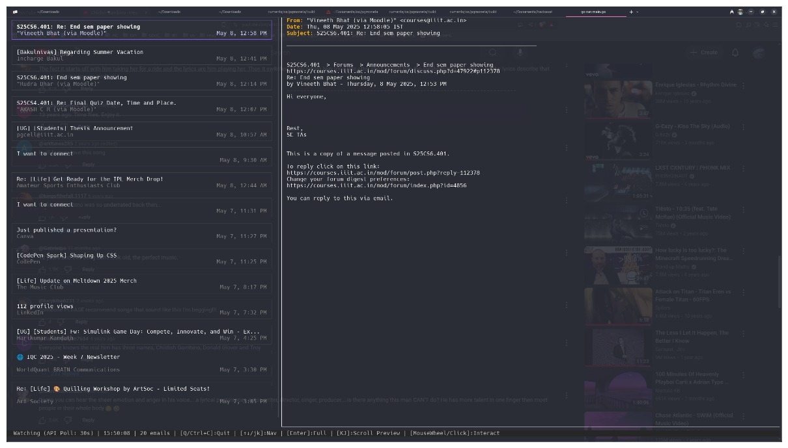

# tmail

terminal mail viewer.

### Preview in [Warp](https://www.warp.dev/) Terminal

## Setup: Gmail API Credentials

`tmail` needs permission to read your emails. You'll create your own API credentials for security:

1.  **Go to Google Cloud Console:** [https://console.cloud.google.com/](https://console.cloud.google.com/)
2.  **Create Project:** Click project dropdown (top left) > **NEW PROJECT**. Name it (e.g., "tmail-app") and click **CREATE**. Make sure it's selected.
3.  **Enable Gmail API:** Search "Gmail API" > Select it > Click **ENABLE**.
4.  **Configure Consent Screen:**
    *   Go to **APIs & Services > OAuth consent screen**.
    *   User Type: **External** > **CREATE**.
    *   Fill in **App name** (e.g., "tmail"), **User support email**, and **Developer contact information** (your email for both).
    *   Click **SAVE AND CONTINUE** through Scopes (no changes needed).
    *   **Test Users:** Click **+ ADD USERS** > Add your **own Gmail address** > **ADD**.
    *   Click **SAVE AND CONTINUE** > **BACK TO DASHBOARD**.
5.  **Create Credentials:**
    *   Go to **APIs & Services > Credentials**.
    *   Click **+ CREATE CREDENTIALS > OAuth client ID**.
    *   Application type: **Desktop app**.
    *   Name: (e.g., "tmail Desktop").
    *   Click **CREATE**.
6.  **Download & Rename:**
    *   In the "OAuth client created" pop-up, click **DOWNLOAD JSON**.
    *   Rename the downloaded file to exactly `credentials.json`.
7.  **Place File:** Put the `credentials.json` file **in the same directory** as the `tmail` application.
8.  **First Run & Authorize:**
    *   Run `tmail` (`./tmail` or `go run main.go`).
    *   Copy the URL shown in the terminal.
    *   Paste the URL into your browser, log in to the Google account you added as a Test User.
    *   Click **Allow** (you might need to click "Advanced" > "Go to [App Name] (unsafe)" if you see a warning).
    *   Copy the authorization code shown by Google.
    *   Paste the code back into the terminal where `tmail` is waiting and press Enter.

`tmail` will save a `token.json` and should now work. Keep `credentials.json` and `token.json` private.
